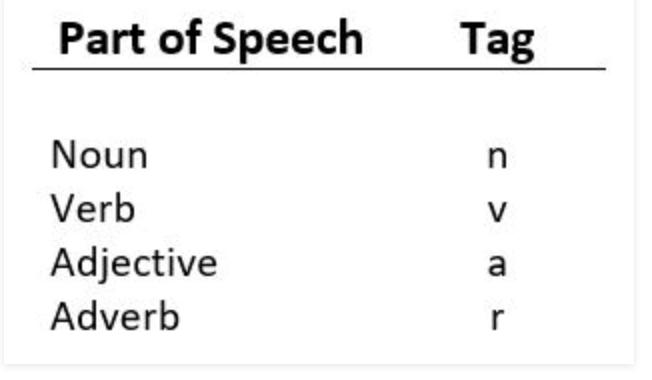

__Part of Speech (POS)__  
Only interested in noun, verb, adjective and adverb  
i.e. POS tag:  
JJ adjective  
JJR adjective, comparative  
JJS adjective, superlative  
NN nounm singular.  
NNS noun plural.  
NNP proper noun, singluar.  
NNPS proper noun, plural.  
RB adverb.  
RBR adverb, comparative.  
RBS adverb, superlative.  
VB verb, base.  
VBD verb, past tense.  
VBG verb, present.  
VBN verb, past.  

__POS v.s Tag__

  